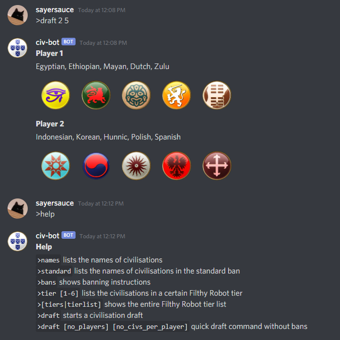

# civ-bot
A Discord bot which creates a [Civilization V](https://en.wikipedia.org/wiki/Civilization_V "Civilization V's Wikipedia Page") draft. Made using [discord.py](https://github.com/Rapptz/discord.py "Discord.py's GitHub Page").

## Usage
Use the `help` command to list commands provided by the bot. Below is an example of the bot being used.



## Installation
Currently the bot is not hosted for public use. Feel free to host it yourself.

Clone this repository and then run these commands:
```sh
# Linux/macOS
python3 -m pip install -r requirements.txt

# Windows
py -3 -m pip install -r requirements.txt
```

Then [create a `config.json`](#configuration).

To run the bot, simply use the command:
```sh
# Linux/macOS
python3 main.py

# Windows
py -3 main.py
```

## Configuration
Example `config.json`
```json 
{
    "token": "your-token-here",
    "prefix": ">",
    "activity": ">help",
    "standard_ban": ["Babylonian", "Polish"]
}
```
